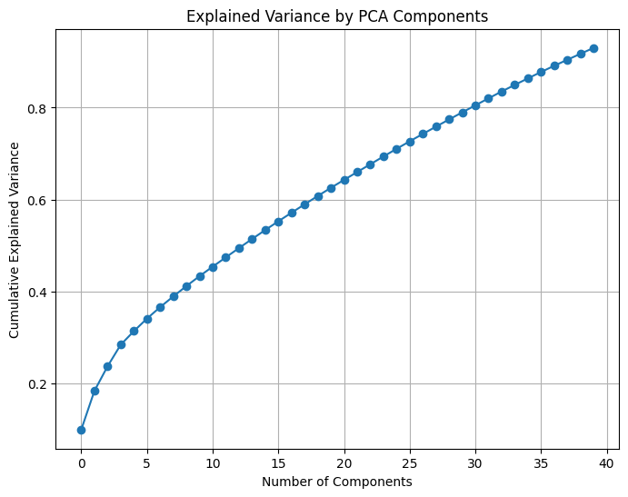
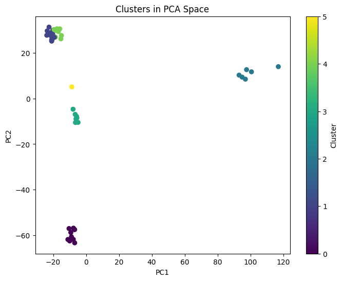
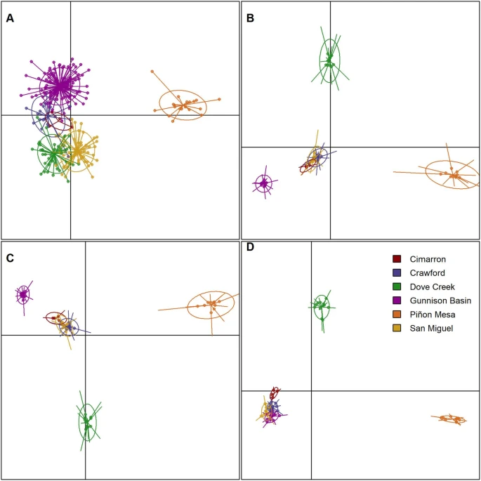

# README: PCA Analysis and Clustering of Gunnison Sage-Grouse Data

## Table of Contents

1. [Motivation and Context](#motivation)
2. [File Overview](#file-overview)
3. [Detailed Code Walkthrough](#detailed-code-walkthrough)
   - [3.1 Data Loading and Preparation](#31-data-loading-and-preparation)
   - [3.2 PCA Computation](#32-pca-computation)
   - [3.3 Explained Variance Plot](#33-explained-variance-plot)
   - [3.4 Clustering in PCA Space](#34-clustering-in-pca-space)
4. [Comparison to the Original Paper](#comparison-to-the-original-paper)
5. [Conclusion and Takeaways](#conclusion-and-takeaways)
6. [Acknowledgments and References](#acknowledgments-and-references)

## Motivation

In the Evolutionary Genetics (BIOL-454) course taught by Parul Johri, Ph.D at University of North Carolina at Chapel Hill we read the paper [Genes mirror geography within Europe](https://pubmed.ncbi.nlm.nih.gov/18758442/), (Novembre, J) about how PCA (Principal Component Analysis) was used on human genomes in Europe to map population structure.

I explain more about PCA later in the README, but this method of data analysis allows researchers to simplify high dimensional data by finding axis that explain the highest variance. If you then plot the data based on these axes you are often able to find trends in the data despite the extreme complexity.

Genetic information is perfect for this since it has both high dimensionality (many base-pair sites) and also high homogeneity(genomes are mostly similar). In the paper researchers performed PCA to differentiate the data and plotted the points on a 2D graph where the axes were the first two PCA Components (axes that described the most variance). Shockingly, the plot strongly resembled the geography of Europe and you were even able to pick out significant geographical landmarks such as seas and mountain ranges.

The first two Principal Components corresponded to longitude and latitude with high accuracy and drew my attention to how powerful this method of analysis could be. I decided to try PCA out for myself to gain a better understanding of how it works and its applications.

I decided to work on two projects:

1. **Sage Grouse Genome PCA**

   The first project was using genetic data from the Gunnison Sage Grouse to replicate the results of PCA in the paper [An empirical comparison of population genetic analyses using microsatellite and SNP data for a species of conservation concern](https://doi.org/10.1186/s12864-020-06783-9) by Zimmerman, S.J.

   My goal for this project was to prove that I have the tools to both work with raw sequence data and perform PCA in a way that is consistent with the reference paper to identify subpopulations.

   Since my overall motivation to learn more about PCA came from [Genes mirror geography within Europe](https://pubmed.ncbi.nlm.nih.gov/18758442/), (Novembre, J) which used this technique to identify subpopulations, I wanted to find a study that did something similar.

   I broke this project down into three points of focus:

   **Load and Clean Data**

   - Load the raw sequence data
   - Clean it in a way that will work with PCA and plotting

   **Perform PCA**

   - Use the `sklearn` library to perform PCA on the
   - Graph explained variance by components
   - Plot first to principal components
   - Color code distinct clusters

   **Compare Results**

   - See how my results are similar and different from those in the paper
   - Evaluate effectiveness of using PCA to find subpopulations

   I then applied what I had learned to a new and more in depth project that worked with cancer data. That project is described below.

2. **Breast Cancer Genome Analysis**

In this project I used RNA expression and Mutation data for breast cancer cells in over 2000 patients to perform PCA and LDA and then plotted the results on interactive plots. My goal for this project was to utilize PCA to identify trends and insights in the high dimensional data that may not be obvious without dimensionality reduction. I also applied LDA plots to visualize any correlations between groupings of data.

This project is in another Github repository linked [HERE](https://github.com/elixf7/Breast-Cancer-PCA) if you wish to learn more.

## File Overview

- **Gunnison_Sage_Grouse_PCA.ipynb**
  Main analysis notebook containing all code cells for data loading, PCA, and clustering.

- **Figures/**  
  Contains the images you see referenced below (e.g., explained variance plot, clustering with 2/4/8/20 components, final PCA plots).

- **README.md**  
  (This file) Describes the purpose, flow, and interpretation of the analysis.

## Detailed Code Walkthrough

### 3.1 Data Loading and Preparation

```python
# Example
import pandas as pd
import numpy as np
from sklearn.decomposition import PCA
from sklearn.preprocessing import StandardScaler
from sklearn.cluster import KMeans
from sklearn.discriminant_analysis import LinearDiscriminantAnalysis as LDA

# Load Dataset
vcf_file = 'Samplecollection/GUSG_SNPs.vcf'
# Read the VCF file
callset = allel.read_vcf(vcf_file, fields=['samples', 'calldata/GT'])
```

**Importing Libraries**

- pandas for handling tabular data
- numpy for numerical operations
- sklearn.decomposition.PCA for principal component analysis
- sklearn.preprocessing.StandardScaler for scaling features
- sklearn.cluster.KMeans for clustering

**Loading the Dataset**
Here the data is in a VCF where each data line includes information such as the chromosome, position, reference base, alternate bases, quality score, and other relevant data

**Motivation**

- High-quality, complete data is essential for robust PCA.

### 3.2 PCA Computation

```python
# Scale features
scaler = StandardScaler()
data_scaled = scaler.fit_transform(data)

# PCA - keep as many components as columns
n_components = data.shape[1]
pca = PCA(n_components=n_components)
principal_components = pca.fit_transform(data_scaled)
```

**Standardization**
Genetic data often contain markers on different scales or with different variance. Standardizing centers each feature around zero with unit variance.

**PCA Initialization**
Setting n_components to the number of features (loci) ensures we initially capture all possible variance. We can later decide how many PCs to retain.

**PCA Transformation**
pca.fit_transform(data_scaled) produces a matrix of the same shape as the original data but in the new PCA space. Each column is a principal component (PC).

### 3.3 Explained Variance Plot

```python
# Plot cumulative explained variance
import matplotlib.pyplot as plt

explained_variance_ratio = np.cumsum(pca.explained_variance_ratio_)

plt.figure(figsize=(8,6))
plt.plot(range(1, n_components+1), explained_variance_ratio, 'o-')
plt.title("Explained Variance by PCA Components")
plt.xlabel("Number of Components")
plt.ylabel("Cumulative Explained Variance")
plt.show()
```



**Figure: "Explained Variance by PCA Components"**
This scree plot shows how much of the genetic variation is captured by each additional principal component. In the figure, we see that by around 30–35 components, we capture a large portion (e.g., 80%+) of the overall variance.

**Interpretation**
In this project we will only work with 2 components (easier to visualize and is consistent with the reference paper) but it is remarkable to see how much variation can be captured with just a handful of components. This could help me decide how many PCs to keep in later steps if I were using more. Often, we look for a plateau or an "elbow" where the explained variance starts leveling out.

### 3.4 Clustering in PCA Space

#### 3.4.1 PCA with Specific Numbers of Components

```python
def cluster_pca_data(data_scaled, n_pcs):
    pca_temp = PCA(n_components=n_pcs)
    pca_data = pca_temp.fit_transform(data_scaled)
    kmeans = KMeans(n_clusters=6, random_state=42)  # e.g., 6 populations
    clusters = kmeans.fit_predict(pca_data)
    return pca_data, clusters

# Compare n_pcs = 2, 4, 8, 20
for n_pcs in [2, 4, 8, 20]:
    pca_data_n, clust = cluster_pca_data(data_scaled, n_pcs)
    # store or plot pca_data_n along PC1 & PC2 for visualization
```

**Function Explanation**

- `cluster_pca_data` takes in scaled data and a specified number of PCs, runs PCA, then clusters the resulting principal components using K-means.
- KMeans is given a guessed number of clusters (6, for example), which might be known or hypothesized based on prior knowledge of the populations.

#### 3.4.2 Final PCA Plot with Clusters

```python
# Example of final PCA with two components
pca_final = PCA(n_components=2)
pca_2_data = pca_final.fit_transform(X_train_std)
kmeans_2 = KMeans(n_clusters=6, random_state=42)
clusters_2 = kmeans_2.fit_predict(pca_2_data)

plt.figure(figsize=(8,6))
plt.scatter(pca_2_data[:,0], pca_2_data[:,1], c=clusters_2, cmap='viridis')
plt.title("Clusters in PCA Space")
plt.xlabel("PC1")
plt.ylabel("PC2")
plt.colorbar(label="Cluster")
plt.show()
```

**Figure: "Clusters in PCA Space"**
We see distinct groupings, with each color indicating a different K-means cluster. In the figure, certain clusters appear well-separated along both PC1 and PC2 axes.

## Comparison to the Original Paper

From the figures and cluster patterns, you can see that:

- **Degree of Differentiation**: The original paper also found strong genetic structure among Gunnison Sage-Grouse populations. The PCA clustering results reflect a similar pattern of clearly separated populations.
- **Number of Groups**: In the paper, they identified around six to seven distinct populations depending on the dataset (SNP vs. microsatellites). The K-means approach with, say, 6 clusters corresponds well to their known groupings.
- **Magnitude of Separation**: The paper noted that Gunnison Basin was quite distinct from smaller satellite populations; the PCA scatter plot mirrors this, with certain clusters (colors) positioned far apart in PC space.

You can clearly see that my PCA results very closely matched the plots in the paper. Specifically, in Panel C of the research paper you can easily match up the subpopulations with the ones derived in this project. In Panels B and D you can also see a clear correspondence if you rotate my plot 90 degrees counterclockwise (axes were plotted differently). In all three panels that graphed PCA results of SNPs you can see visual proof of consistency with my own analysis. My approach included ALL SNPs in my analysis, but despite the paper splitting the SNPs up into categories you can still see a strong correlation between the two.

My plot also preserved the distance between groupings quite well. Subpopulations that were geographically further apart were indeed further apart on the plot showcasing their genetic diversity compared to closer groups. It was neat to see how geographical distance, which directly effects differentiation, was showing up on my PCA plot which was derived purely from genetic data.

Overall, the findings match closely to the patterns in the publication: strong separation, multiple distinct populations, and the overall shape of the cluster solutions is consistent with the known isolation among Gunnison Sage-Grouse populations.



My PCA with Two Components



Star-plots of DF1 (x-axis) and DF2 (y-axis) from discriminant analysis of principal components (DAPC) for Gunnison sage-grouse. Panels correspond to different datasets: a microsatellite, b all SNPs, c putatively neutral SNPs, d and candidate adaptive SNPs. Each point represents an individual color coded by sampling origin

## Conclusion and Takeaways

PCA is a key tool in population genetics because:

- **Dimensionality Reduction**: Genetic datasets can have thousands of markers. PCA compresses this high-dimensional data into a few principal components that capture the bulk of variation.
- **Visualization**: By plotting just two PCs, we can see how distinct sub-populations or clusters are.
- **Interpretation**: PC loadings sometimes reveal which markers drive population differences, helping us hypothesize about local adaptation or drift.

In this project, PCA was vital to uncover patterns that align well with known population boundaries, offering strong support for the structured nature of Gunnison Sage-Grouse populations.

Overall I gained a better understanding of how PCA works, and how genetic data in particular is a great fit for this type of analysis due to its high dimensionality and homogeneity. I got experience working with raw sequencing data, and was successfully able to identify subpopulations that matched the results from my reference paper.

I now feel confident in using PCA for other projects, and applied it in a more in-depth project involving breast cancer RNA and mutation data linked [HERE](https://github.com/elixf7/Breast-Cancer-PCA).

## Acknowledgments and References

**Original Data Source / Article**:

Zimmerman, S.J., Aldridge, C.L. & Oyler-McCance, S.J. An empirical comparison of population genetic analyses using microsatellite and SNP data for a species of conservation concern. BMC Genomics 21, 382 (2020). https://doi.org/10.1186/s12864-020-06783-9

[Link to Paper](https://bmcgenomics.biomedcentral.com/articles/10.1186/s12864-020-06783-9#availability-of-data-and-materials)

[Link to Data](https://www.sciencebase.gov/catalog/item/5cc0d333e4b09b8c0b726ce3)

[Link to Metadata](https://www.sciencebase.gov/catalog/file/get/5cc0d333e4b09b8c0b726ce3?f=__disk__3c%2F2f%2Fc4%2F3c2fc41ccaffac7721cb36c6f4f680f2929b53a4&transform=1&allowOpen=true)

**Software Tools**

- Python 3, NumPy, Pandas, scikit-learn

**Author**:
Eli Fried
